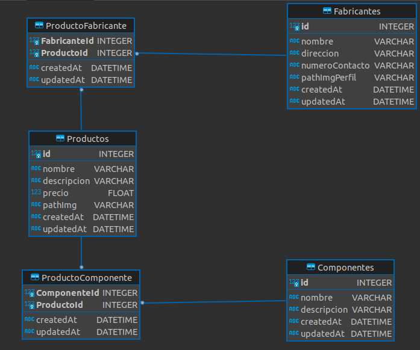

# TP-NtoM - Grupo Aykema

Repositorio del trabajo práctico 1, creado por el **Grupo Aykema**.

## Descripción

Este proyecto consiste en un API REST construida con Node.js, Express y Sequelize que implementa asociaciones de tipo "muchos a muchos" (M:N). Se utiliza **PostgreSQL** con Docker como base de datos por defecto, pero también se puede configurar para usar **SQLite** sin docker. 

## Estructura del Proyecto

- **src/index.js**: Punto de entrada de la aplicación.
- **/models**: Modelos Sequelize que representan las tablas de la base de datos.
- **/routes**: Rutas para interactuar con los recursos.
- **/controllers**: Lógica para manejar las solicitudes y respuestas de las rutas.
- **/config**: Configuraciones de la aplicación.
- **/middlewares**: Contiene los middlewares personalizados.
- **/schemas**: Define los esquemas de validación de datos utilizando Joi.

## Dependencias

### Principales:

- **express**: Framework para crear la API.
- **sequelize**: ORM para manejar las asociaciones y consultas de la base de datos.
- **sqlite3**: Base de datos por defecto para el proyecto.
- **pg**: Driver para PostgreSQL.
- **pg-hstore**: Utilidad para serializar/deserializar datos JSON en PostgreSQL.
- **joi**: Dependencia para la validación de datos.
- **dotenv**: Carga variables de entorno desde un archivo `.env`.

### Desarrollo:

- **nodemon**: Herramienta para reiniciar el servidor automáticamente durante el desarrollo.
- **sequelize-cli**: CLI para manejar las migraciones y otros comandos de Sequelize.

## Instalación

1. Clonar el repositorio:

   ```bash
   git clone https://github.com/EP-2024C2/tp-ntom-aykema
   cd tp-ntom-aykema
    ```

2. **Instalar las dependencias**:

   ```bash
   npm i
    ```

### 3. Configurar la base de datos:

- Por defecto, el proyecto está configurado para utilizar PostgreSQL.
- Se puede usar otra base de datos, solo hay que actualizar la configuración en el archivo `/models/index.js` y descomentar las líneas necesarias para sincronizar con la nueva base de datos.
- **Nota**: Si usas `db.sequelize.sync({force: true})` de `/src/index.js` para crear las tablas, tener en cuenta que esto eliminará y recreará las tablas existentes.

#### Usar PostgreSQL con Docker:

1. **Levantar los servicios de Docker**:

   Asegurarse de que Docker esté instalado y en ejecución en tu máquina. Despues, ejecutar el siguiente comando en la raíz del proyecto para levantar los servicios definidos en el archivo `docker-compose.yml`:

   ```bash
   docker-compose up -d
    ```

## Uso

### Desarrollo

Para iniciar la aplicación en modo desarrollo con **Nodemon**, ejecuta:

```bash
npm run dev
```

### Producción

Para iniciar la aplicación en producción, ejecuta:

```bash
npm start
```
La aplicación estará disponible en [http://localhost:3001](http://localhost:3001).

## Rutas

Las rutas definidas en la aplicación son:

### Componentes
- `GET /componentes`: Obtiene todos los componentes.
- `GET /componentes/:id`: Obtiene un componente por su ID.
- `POST /componentes`: Crea un nuevo componente.
- `DELETE /componentes/:id`: Elimina un componente por su ID.
- `PUT /componentes/:id`: Actualiza un componente por su ID.
- `GET /componentes/:id/productos`: Obtiene los productos asociados a un componente por su ID.

### Fabricantes
- `GET /fabricantes`: Obtiene todos los fabricantes.
- `GET /fabricantes/:id`: Obtiene un fabricante por su ID.
- `POST /fabricantes`: Crea un nuevo fabricante.
- `DELETE /fabricantes/:id`: Elimina un fabricante por su ID.
- `PUT /fabricantes/:id`: Actualiza un fabricante por su ID.
- `GET /fabricantes/:id/productos`: Obtiene los productos asociados a un fabricante por su ID.

### Productos
- `GET /productos`: Obtiene todos los productos.
- `GET /productos/:id`: Obtiene un producto por su ID.
- `POST /productos`: Crea un nuevo producto.
- `DELETE /productos/:id`: Elimina un producto por su ID.
- `PUT /productos/:id`: Actualiza un producto por su ID.
- `GET /productos/:id/componentes`: Obtiene los componentes asociados a un producto por su ID.
- `GET /productos/:id/fabricantes`: Obtiene los fabricantes asociados a un producto por su ID.
- `POST /productos/:id/componentes`: Agrega un componente a un producto por su ID.
- `POST /productos/:id/fabricantes`: Agrega un fabricante a un producto por su ID.

## Diagrama



## Autores

- **Kevin Caria**
- **Martin Bruno**
- **Aymara Dileo**